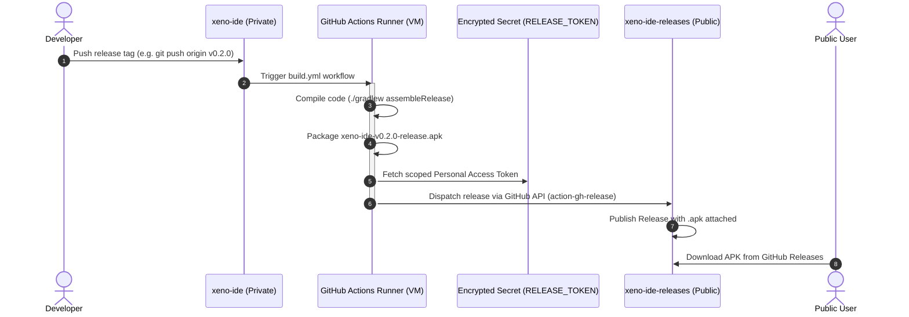

# Architecture & Distribution Model

This document explains how **Xeno IDE** is built, distributed, and maintained using a secure **Dual-Repository Pattern** that keeps the proprietary source code private while providing seamless public APK releases on GitHub.

---

## 1. Overview: The Dual-Repository Pattern

GitHub does not natively support making only the "Releases" section of a private repository public. To distribute application binaries to the public without open-sourcing the underlying codebase, Xeno IDE uses two distinct repositories:

```
┌────────────────────────────────────────────────────────┐
│             xeno2426/xeno-ide [PRIVATE]                │
│                                                        │
│  • 100% of Kotlin & Jetpack Compose Source Code        │
│  • Gradle build configurations & build scripts         │
│  • Internal issue tracker & feature roadmap            │
│  • GitHub Actions CI/CD workflow definition            │
└───────────────────────────┬────────────────────────────┘
                            │
              Automated Build & Cross-Repo Push
              (Triggered on Git release tags)
                            │
                            ▼
┌────────────────────────────────────────────────────────┐
│          xeno2426/xeno-ide-releases [PUBLIC]           │
│                                                        │
│  • Public landing page & Documentation                 │
│  • Community issue tracker & bug reporting             │
│  • GitHub Releases hosting standalone .apk binaries    │
│  • ZERO source code files                              │
└────────────────────────────────────────────────────────┘
```

---

## 2. How the Source Code is Protected

### A. Strict Repository Access Boundaries
The core repository (`xeno2426/xeno-ide`) is configured as **Private** on GitHub. Only authenticated repository collaborators have access. The public has no permission to read the commit history, pull requests, issues, or source files.

### B. Ephemeral Isolated Build Runners
When an update is pushed:
1. GitHub Actions spins up an isolated, single-use Ubuntu virtual machine inside GitHub's secure infrastructure.
2. The runner clones the private codebase into its sandboxed environment.
3. The Android Gradle Plugin compiles Kotlin code directly into Dalvik/ART bytecode (`.dex`), links Android resources (`resources.arsc`), and packages the unsigned/debug-signed `.apk`.
4. Once the release APK is generated and uploaded, the virtual machine is immediately destroyed.

### C. Zero Source Code Leakage
The public repository (`xeno-ide-releases`) **never receives source code files, Git history, or compiler intermediate files**. It only receives:
1. The packaged binary artifact (`xeno-ide-vX.Y.Z-release.apk`).
2. Release metadata (tag name, version code, changelog notes).

---

## 3. How Both Repositories are Connected

The connection between the private codebase and the public releases portal is automated through **GitHub Actions** and a **Scoped Authentication Secret**:



### Detailed Pipeline Stages

#### 1. Trigger (`build.yml`)
The workflow in the private repo listens for push events on tags matching `v*`:
```yaml
on:
  push:
    branches: [ "main" ]
    tags: [ "v*" ]
  workflow_dispatch:
```

#### 2. Compilation & Verification
The runner sets up Java 17 and executes the release build task:
```bash
./gradlew assembleRelease --no-daemon --stacktrace
```
This runs D8 desugaring, resource shrinking, packaging, and writes metadata to `output-metadata.json`.

#### 3. Cross-Repository Authentication
To allow the private repository runner to create releases in the external public repository, an encrypted Actions secret named `RELEASE_TOKEN` is configured in `xeno-ide`:
- **Secret Name:** `RELEASE_TOKEN`
- **Scope:** Restricted to `repo` permissions for managing releases and tags.
- **Storage:** Securely encrypted in GitHub Key Vault; never exposed in logs.

#### 4. Automated Release Dispatch
The action publishes the APK artifact to `xeno2426/xeno-ide-releases`:
```yaml
- name: Publish Release to Public Releases Repo
  if: startsWith(github.ref, 'refs/tags/v')
  uses: softprops/action-gh-release@v2
  with:
    repository: xeno2426/xeno-ide-releases
    tag_name: ${{ github.ref_name }}
    files: ${{ env.APK_PATH }}
    generate_release_notes: true
    token: ${{ secrets.RELEASE_TOKEN }}
```

---

## 4. Security & Isolation Guarantees

| Security Concern | Mitigation / Guarantee |
| :--- | :--- |
| **Source Exposure** | The public repository contains no commits from the private repository. The two Git trees are completely independent. |
| **Credential Security** | `RELEASE_TOKEN` is stored in GitHub Encrypted Secrets and is never printed in build logs or exposed to public users. |
| **One-Way Flow** | Code and artifacts only flow **outward** (Private -> Public). Actions taken on the public repository (e.g. issues, comments) have zero access to the private repository. |
| **Tamper Resistance** | Release APKs are generated automatically by GitHub's official Ubuntu runners directly from verified Git tags. |

---

## 5. Releasing a New Version

To release a new update to users:

1. Update `versionCode` and `versionName` in `app/build.gradle.kts`.
2. Commit and push changes to `main`.
3. Create and push a version tag:
   ```bash
   git tag v0.2.0
   git push origin v0.2.0
   ```
4. GitHub Actions will automatically compile the APK and publish the release to this repository within ~1-2 minutes.
