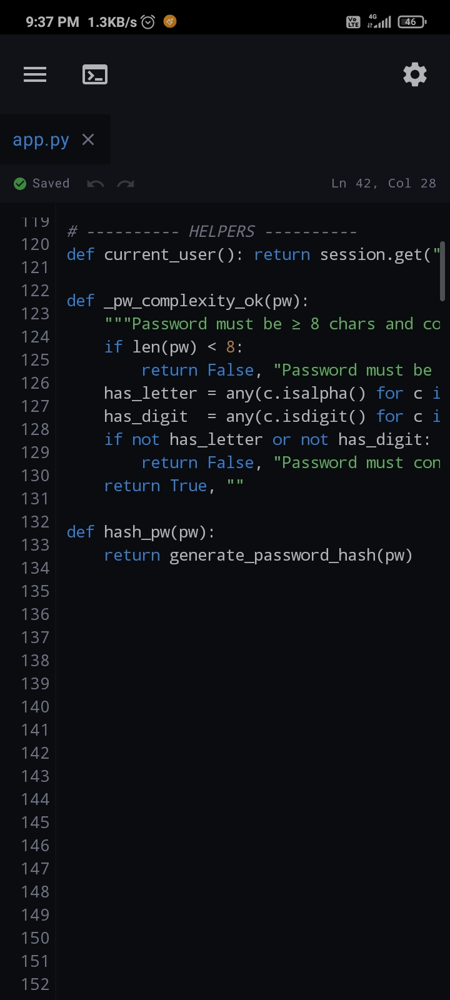

# Xeno IDE 📱⚡

> **A fast, phone-native Android Integrated Development Environment built entirely with Kotlin and Jetpack Compose.**

Xeno IDE delivers a complete offline coding workflow directly on Android devices—featuring an integrated code editor, workspace file management, embedded multi-session terminal, and native Git integration without requiring a PC or root access.

---

  

---

## 🚀 Features

- **⚡ 60fps Mobile Code Editor**: Virtualized line rendering, sub-pixel aligned line numbers, instant cursor positioning, and typing latency under 16ms.
- **🎨 Syntax Highlighting & Autocomplete**: Decoupled background syntax highlighting with windowed memory safeguards and context-aware word suggestions.
- **💾 Background Non-Blocking Autosave**: Disk persistence managed completely off the UI thread via a dedicated `SaveCoordinator` with idle debounce and forced flush ceiling.
- **🌿 In-App Git Management**: Clone, commit, push, pull, status, and branch operations directly on your phone using pure Java/Kotlin Eclipse JGit (no native Git binaries or Termux required).
- **🔒 Hardware-Backed Security**: Encrypted GitHub token storage via Android KeyStore and `EncryptedSharedPreferences`.
- **💻 Embedded Terminal**: Interactive shell session with ANSI color parsing and workspace directory tracking.
- **📁 File Explorer**: Full workspace navigation, file creation, tab management, and search.

---

## 📥 Installation Guide

1. Head over to the **[Latest Release](https://github.com/xeno2426/xeno-ide-releases/releases/latest)** page.
2. Under **Assets**, click on `xeno-ide-v0.1-release.apk` to download the APK.
3. Open the downloaded file on your Android device.
4. If prompted, enable **"Install from unknown sources"** for your browser/file manager.
5. Tap **Install** and launch **Xeno IDE**!

> **Requirements:** Android 7.0 (API level 24) or higher.

---

## 🔒 Security & Distribution Architecture

Xeno IDE operates on a **Dual-Repository Model**:
- **Source Code Protection:** All core Kotlin code, build configurations, and development work remain strictly private in the `xeno-ide` repository.
- **Public Binary Distribution:** This repository serves as the official public distribution portal hosting verified application binaries (`.apk`) and issue tracking.
- **Automated Delivery:** Releases are compiled in ephemeral GitHub Actions virtual environments and automatically dispatched here via encrypted credentials upon tagging new versions.

📖 For complete details on the security boundaries, token isolation, and automated CI/CD pipeline, see **[ARCHITECTURE.md](ARCHITECTURE.md)**.

---

## 🐛 Feedback & Bug Reports

Encountered an issue or have a feature request?
Please open an issue on the public issue tracker:
👉 **[Open an Issue](https://github.com/xeno2426/xeno-ide-releases/issues)**
